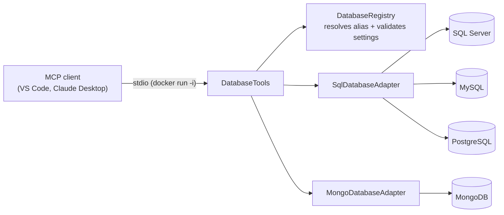

# DbMcp

DbMcp is a [Model Context Protocol](https://modelcontextprotocol.io) (MCP) server that lets AI agents work with **SQL Server**, **MySQL**, **PostgreSQL**, and **MongoDB** databases. It runs as a Docker container and talks MCP over stdin/stdout.

> [!WARNING]
> **This tool can be dangerous. Use it with caution.**
> DbMcp gives an AI agent direct access to your databases. It can read, insert, change and delete data, and `execute_sql` runs any SQL it is given, including `DELETE`, `DROP` and `TRUNCATE`, using the credentials you configure. Read the [Safety](#safety) section before connecting it to anything you care about.

## Pages

| Page | Contents |
| --- | --- |
| [[Configuration]] | Environment variables, providers, validation rules, config file mounting |
| [[Tools]] | Every MCP tool, its parameters, results and examples |
| [[MCP Client Setup|MCP-Client-Setup]] | Adding DbMcp to VS Code and Claude Desktop |
| [[Docker on Windows|Docker-on-Windows]] | Reaching databases on the host, in other containers, in Compose or WSL |

## How it works

- Databases are configured on the server under **aliases** (for example `local` or `reporting`). Clients pick an alias; they never see or send a connection string.
- Every tool takes an optional `database` argument. It can be left out only when exactly one database is configured.
- The database account's permissions are the only thing limiting what the tools can do.
- Logs go to stderr, because stdout carries the MCP protocol.



## Quick start

1. Pull the image:

   ```powershell
   docker pull ghcr.io/zerowiggliness/dbmcp:latest
   ```

   Pin a version tag from [Releases](https://github.com/ZeroWiggliness/dbmcp/releases) instead of `latest` for repeatable setups.

2. Add it to your MCP client. For VS Code, create `.vscode/mcp.json`:

   ```json
   {
     "inputs": [
       { "type": "promptString", "id": "db-password", "description": "Database password", "password": true }
     ],
     "servers": {
       "DbMcp": {
         "type": "stdio",
         "command": "docker",
         "args": [
           "run", "--rm", "-i",
           "-e", "DbMcp__Databases__local__Provider=Postgres",
           "-e", "DbMcp__Databases__local__Address=host.docker.internal",
           "-e", "DbMcp__Databases__local__DefaultDatabase=sample",
           "-e", "DbMcp__Databases__local__Username=app",
           "-e", "DbMcp__Databases__local__Password",
           "ghcr.io/zerowiggliness/dbmcp:latest"
         ],
         "env": { "DbMcp__Databases__local__Password": "${input:db-password}" }
       }
     }
   }
   ```

3. Start the server from the MCP view and ask the agent to "list the tables in the local database".

See [[MCP Client Setup|MCP-Client-Setup]] for Claude Desktop, env files and multiple databases, and [[Docker on Windows|Docker-on-Windows]] if the database runs in another container.

## Safety

- **Use a dedicated, least-privilege account.** Prefer read-only access. Grant write permissions only on the tables the agent actually needs.
- **Keep it away from production** unless you have reviewed the risk, and keep tested backups of anything it can reach.
- **Review tool calls before approving them.** `execute_sql`, `insert` and `delete` change data. `execute_sql` accepts any SQL for relational databases.
- **Beware prompt injection.** Data read from a database can contain text that tries to steer the agent into harmful tool calls.
- **Only connect MCP clients you trust.** Every client runs with the configured database credentials.
- **Keep credentials out of source control and command lines.** Pass them through client secret prompts, environment variables or env files.

## Development

For contributors only. With Docker running:

```powershell
dotnet test DbMcp.Tests/DbMcp.Tests.csproj -c Release --settings .runsettings --collect:"XPlat Code Coverage"
```

The suite starts disposable SQL Server, MySQL, PostgreSQL and MongoDB containers using Testcontainers. CI fails below **95% line coverage** (`Program.cs` excluded) and, after a passing push to the default branch, publishes `ghcr.io/zerowiggliness/dbmcp:latest` plus a release-version tag.

## License

DbMcp is released under the [MIT License](https://github.com/ZeroWiggliness/dbmcp/blob/master/LICENSE). It is provided "AS IS", without warranty of any kind. The authors and copyright holders accept no liability for any damage, data loss or other consequences of its use. You use it entirely at your own risk.
